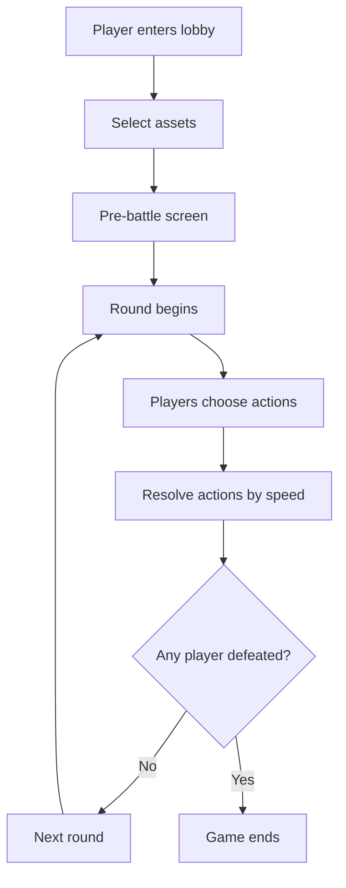

# Battle Arena Game Design Document

## Overview
A strategic 1v1 or 2v2 turn-based battle game for web dapps. Players own multiple assets (characters, monsters, etc.) with unique stats and abilities. Assets can be upgraded and bred for progression and variety.

---

## Core Concepts

### Assets
- Each player owns a collection of assets.
- Asset stats: HP, Attack, Defense, Speed, Stamina, Special Ability.
- Assets can be upgraded by playing and winning battles.
- Breeding allows creation of new assets inheriting stats/abilities.

### Game Modes
- **1v1:** Each player selects one asset for battle.
- **2v2:** Each player selects two assets, enabling team strategies and synergy.

---

## Game Flow

### Matchmaking & Game Start
1. Players enter a lobby and are matched for a battle.
2. Each player selects their asset(s) from their owned collection.
3. Pre-battle screen displays chosen assets and stats.

### Round Structure
- Turn-based: Each round, both players select actions for their asset(s).
- Actions resolve simultaneously, with speed stat determining priority.

#### Actions per Round
- **Attack:** Deal damage based on attack stat.
- **Defend:** Reduce incoming damage, boost defense.
- **Special Ability:** Unique to asset (heal, buff, debuff, dodge, etc.).
- **Rest:** Recover stamina or minor HP.

#### 2v2 Specifics
- Players choose actions for both assets.
- Assets can support each other (e.g. one defends, one attacks, combo abilities).
- Turn order based on speed stats of all assets.

### Strategy
- Players must predict and counter opponent moves.
- Bluffing and mind games are encouraged.
- Team composition and synergy matter in 2v2.

---

## Win Condition
- Win when all opponent assets’ HP reach zero.
- Optional: Round/time limit; highest HP or score wins if limit reached.

---

## Progression & Upgrades
- Winning grants experience or upgrade points.
- Assets can improve stats or unlock new abilities.
- Breeding system allows combining assets to create new ones with inherited stats/abilities.

---

## Asset Stat System

| Stat      | Description                                  |
|-----------|----------------------------------------------|
| HP        | Health Points; asset is defeated at 0        |
| Attack    | Damage dealt when attacking                  |
| Defense   | Reduces incoming damage                      |
| Speed     | Determines action priority                   |
| Stamina   | Limits use of powerful actions               |
| Special   | Unique ability per asset                     |

---

## Breeding Logic
- Select two owned assets to breed.
- Offspring inherits a mix of parent stats and abilities.
- Randomness or weighted averages can be used for stat inheritance.
- Breeding cooldowns and rarity mechanics can be added.

---

## Example Round (2v2)
1. Both players select actions for each asset.
2. Actions are revealed and resolved in order of speed.
3. Damage, defense, and abilities are applied.
4. Check for defeated assets.
5. Next round begins.

---

## Replayability Features
- Asset progression and upgrades.
- Breeding for new asset combinations.
- Strategic depth in team composition and move selection.
- Regular addition of new assets, abilities, and events.

---

## Implementation Notes
- Turn-based logic can be handled server-side for fairness.
- Real-time UI updates for action selection and resolution.
- Asset data stored on-chain or in a secure backend.
- Extensible for future game modes or features.

---

## Mermaid Diagram: Game Flow

---

## Summary
This document provides all necessary context and rules for an AI language model to implement the Battle Arena game logic, including asset management, round structure, progression, breeding, and strategic gameplay.
